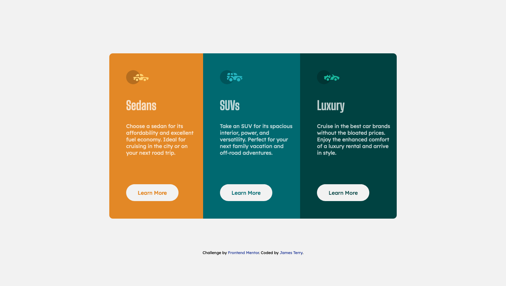

# Frontend Mentor - 3-column preview card component solution

This is a solution to the [3-column preview card component challenge on Frontend Mentor](https://www.frontendmentor.io/challenges/3column-preview-card-component-pH92eAR2-). Frontend Mentor challenges help you improve your coding skills by building realistic projects.

## Table of contents

- [Overview](#overview)
  - [The challenge](#the-challenge)
  - [Screenshot](#screenshot)
  - [Links](#links)
- [My process](#my-process)
  - [Built with](#built-with)
  - [What I learned](#what-i-learned)
  - [Continued development](#continued-development)
  - [Useful resources](#useful-resources)
- [Author](#author)

## Overview

### The challenge

Users should be able to:

- View the optimal layout depending on their device's screen size
- See hover states for interactive elements

### Screenshot

### Links

- Solution URL: [Source Code](https://github.com/jatsan/three-col-preview-component)
- Live Site URL: [Live Site](https://jatsan.github.io/three-col-preview-component/)

## My process

### Built with

- Semantic HTML5 markup
- CSS custom properties
- Flexbox
- [BEM](http://getbem.com/) - Naming Convention
- Mobile-first workflow
- [SCSS](https://sass-lang.com/) - CSS Preprocessor
- [Gulp](https://gulpjs.com/) - Workflow Automation Tool

### What I learned

I gained experience working with SCSS/SASS & BEM naming convention. Incorporated Gulp into my workflow.

### Continued development

I would like to start turning my attention more towards accessibility.

### Useful resources

- [BEM 101 / CSS Tricks](https://css-tricks.com/bem-101/) - This helped me with BEM naming convention.

## Author

- Frontend Mentor - [@jatsan](https://www.frontendmentor.io/profile/jatsan)
- GitHub - [@jatsan](https://github.com/jatsan)
